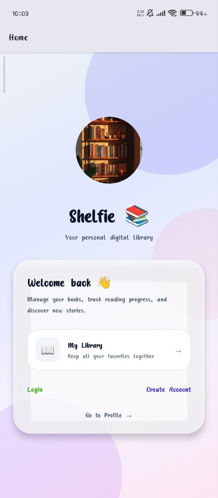
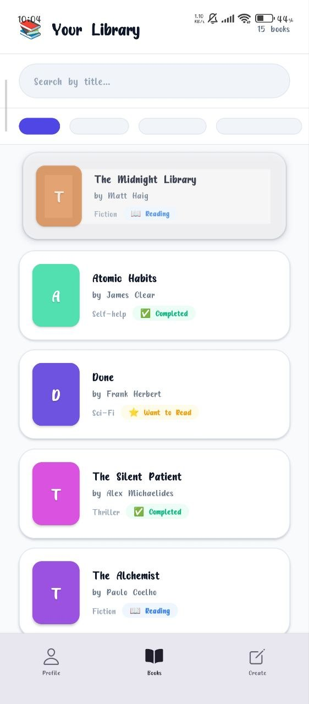

# 📚 Shelfie App

<p align="center">
  
  
  
</p>

<h3 align="center">
A modern bookshelf management mobile application built with React Native and Expo.
</h3>

<p align="center">
Shelfie helps users discover books, manage their personal collections, and organize their reading experience through a clean and intuitive mobile interface.
</p>

---

# 📖 About The Project

Shelfie is a cross-platform mobile application developed with **React Native and Expo**.

The project focuses on building a scalable mobile application architecture using:

- Expo Router navigation
- Reusable React Native components
- Context-based state management
- Clean folder organization
- Modern mobile UI patterns

---

# ✨ Features

## 📚 Book Management

- Browse available books
- View book collections
- Display book details
- Manage personal bookshelf
- Organize reading materials

## 🔐 Authentication

- Authentication flow separation
- Protected dashboard routes
- User session management

## 🎨 User Interface

- Modern mobile UI design
- Responsive layouts
- Dark theme support
- Reusable components

## ⚡ Development Features

- File-based routing with Expo Router
- Component-driven architecture
- Custom React hooks
- Centralized application contexts

---

# 🛠 Tech Stack

## Mobile Application

| Technology | Purpose |
|---|---|
| React Native | Cross-platform mobile development |
| Expo | React Native development platform |
| Expo Router | File-based navigation |
| JavaScript | Application development |
| Context API | Global state management |

## Development Tools

| Tool | Purpose |
|---|---|
| VS Code | Development environment |
| Git | Version control |
| GitHub | Source code management |
| Expo CLI | Development workflow |

---

# 🚀 Getting Started

## Prerequisites

Install:

- Node.js
- npm
- Expo Go application

Check versions:

```bash
node -v
```

```bash
npm -v
```

---

# 📦 Installation

## Clone Repository

```bash
git clone https://github.com/kayzinkhaing/OpenShelf.git
```

Move into project:

```bash
cd shelfie_app
```

Install dependencies:

```bash
npm install
```

---

# ▶️ Run Application

## Start Development Server

```bash
npx expo start
```

## Start With Tunnel

Recommended for testing on physical devices:

```bash
npx expo start --tunnel
```

Tunnel mode allows your mobile device to connect even when your computer and phone are on different networks.

---

# 📱 Run On Device

1. Install **Expo Go**
2. Start the Expo development server
3. Scan the QR code
4. Open Shelfie on your device

---

# 📂 Project Structure

```
shelfie_app
│
├── app/                         # Expo Router application routes
│   │
│   ├── (auth)/                  # Authentication routes
│   │   ├── login
│   │   └── register
│   │
│   ├── (dashboard)/             # Main application routes
│   │
│   ├── _layout.jsx              # Root navigation layout
│   ├── index.jsx                # Application entry route
│   ├── about.jsx                # About screen
│   └── contact.jsx              # Contact screen
│
├── assets/                      # Images, icons, and static files
│   └── img/
│       ├── welcome.jpg
│       ├── bookLists.jpg
│       └── profile.jpg
│
├── components/                  # Reusable UI components
│
├── contexts/                    # Global state management
│
├── hooks/                       # Custom React hooks
│
├── lib/                         # Helper functions and services
│
├── constants/                   # Application constants
│
├── App.js                       # Application configuration
├── index.js                     # Entry point
├── app.json                     # Expo configuration
├── package.json                 # Dependencies
└── README.md
```

---

# 🏗 Architecture Overview

Shelfie follows a clean React Native architecture:

```
        Screens (Expo Router)
                |
                ↓
        Reusable Components
                |
                ↓
        Context / Hooks
                |
                ↓
        Services & Utilities
```

This structure provides:

- Better maintainability
- Reusable components
- Cleaner business logic
- Easier future scaling

---

# 🔮 Future Improvements

- User authentication API integration
- Cloud database synchronization
- Reading progress tracking
- Book recommendation system
- Push notifications
- Offline mode support
- Advanced search functionality

---

⭐ If you like this project, feel free to give it a star!